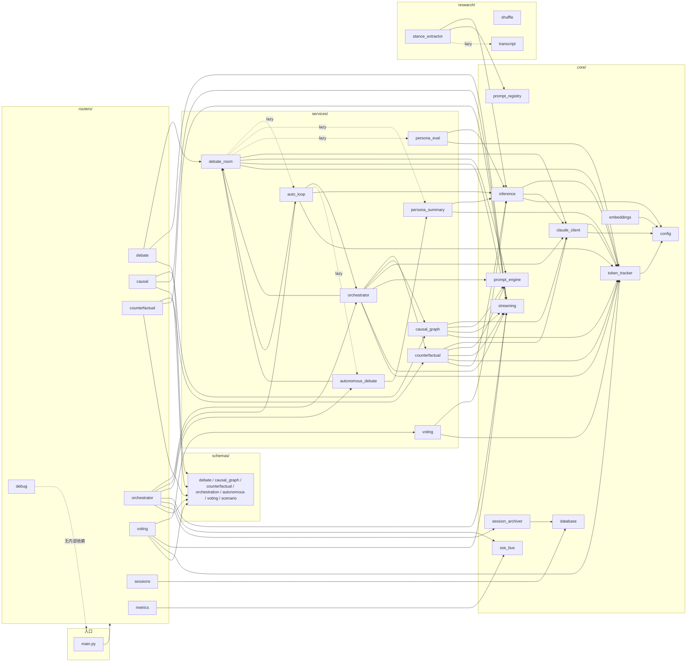
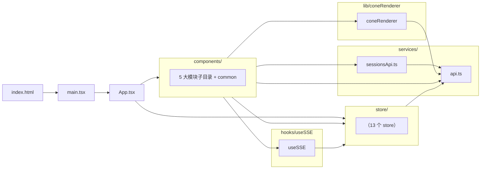

# DEPENDENCIES — 模块耦合静态分析

> 生成时间：2026-05-23
> 方法：对 `backend/app/` 与 `frontend/src/` 下所有 `.py / .ts / .tsx` 文件用 `grep` 提取 import 语句，构建有向引用图。
> 入度（in-degree）= 被多少个其他文件 import；高入度 = 高耦合 = 改动风险大。
> 局限：仅静态扫描；未追踪运行时反射、字符串 import、HTTP/SSE 间接调用、`await import()` 之外的动态 import。文中所有「不确定」均如实标出。

---

## 1. 引用关系（按模块层级）

### 1.1 后端 `backend/app/`

要点说明（基于实际 grep 结果）：
- `routers/` 全部由 `main.py` 一次性 `from app.routers import ...` 引入，每个 router 进一步引用 `services/` 与 `schemas/`。
- `services/` 之间存在跨服务调用：`orchestrator → {counterfactual, causal_graph, debate_room}`；`auto_loop → {orchestrator, debate_room}`；`autonomous_debate → {debate_room, persona_summary}`。
- `core/` 内部链：`inference → claude_client → token_tracker → config`，所有上层 services 都依赖 `core/`。
- `routers/metrics.py` 与 `routers/sessions.py` 内部 lazy import 其它 routers（仅用于读统计数据）。
- `research/` 仅 `services/auto_loop.py` 在运行时 lazy import `shuffle` 与 `stance_extractor`；`stance_extractor` 进而 lazy import `transcript`。

### 1.2 前端 `frontend/src/`

要点（基于 import 提取）：
- 前端整体是**单向 funnel**：`App → components → stores → services/api`。
- `services/api.ts` 是绝对中心（入度 23）。
- 跨模块越界一例：`components/common/ClassroomPanel.tsx` 反向引入 `components/orchestrator/PhilosophicalPresets`（common 依赖 orchestrator，反常）。
- `store/portalStore.ts` 引入 `store/navStore`（store 间唯一耦合）。

---

## 2. 循环依赖

### 2.1 后端

| 路径 | 类型 | 风险 |
|---|---|---|
| `services/auto_loop ⇄ services/debate_room` | `auto_loop` → `debate_room`（顶层 import）；`debate_room` → `auto_loop`（**函数内 lazy import**，引用 `FALSIFIABILITY_DIRECTIVE_ZH`） | ⚠️ 真循环。Python 当前不报错是因为 `debate_room` 端是延迟 import；若把这个 lazy import 提到顶层会立刻 `ImportError`。 |
| `services/auto_loop ⇄ services/autonomous_debate` | `autonomous_debate` 不引 `auto_loop`；但 `auto_loop` 在函数内 lazy import `autonomous_debate`（`RUN_LOG_DIR`）。`autonomous_debate` 顶层引 `debate_room`，而 `debate_room` lazy 引 `auto_loop` | ⚠️ 间接环：`auto_loop → autonomous_debate → debate_room ⇢ auto_loop`，全靠 lazy 化解。 |
| `routers/sessions → routers/orchestrator`（lazy） | `sessions` 在函数内多次 `from app.routers.orchestrator import _auto_loop` | 单向 lazy，未形成回路。 |
| `routers/metrics → 多个 routers`（lazy） | metrics 在函数内 import orchestrator/debate/causal/counterfactual/voting | 单向 lazy。 |
| `core/prompt_registry → 自身` | `prompt_registry.py` 内部有 `from app.core.prompt_registry import load_prompt, list_prompts` | **不确定**是否是 `__main__` 块的自测代码；不影响运行。 |

### 2.2 前端

未检测到任何 import 环。`store/portalStore → store/navStore` 是单向。

---

## 3. 中心模块（高入度 → 改动风险最高）

### 3.1 后端 ranking

| 入度 | 模块 | 角色 | 风险标记 |
|---:|---|---|---|
| **12** | `core/streaming` | SSE 包装 (`sse_event` / `create_sse_response`) | 🔴 极高 — 改签名会影响所有 router 和大部分 services |
| **12** | `core/token_tracker` | 全局 token / 成本累计 | 🔴 极高 |
| **11** | `core/inference` | Claude / Ollama 后端工厂（`get_strong_backend` 等） | 🔴 极高 — 后端路由切换全靠它 |
| **9**  | `config` | pydantic-settings | 🔴 高 — env 变量加减都波及 |
| **6**  | `core/prompt_engine` | Jinja2 渲染 | 🟠 高 |
| **6**  | `core/claude_client` | Anthropic SDK 封装 | 🟠 高 |
| **4**  | `services/debate_room` | 5 处复用（orchestrator/auto_loop/autonomous_debate + 自身 router） | 🟡 中 |
| **4**  | `schemas/debate` | 跨 router + 跨 service | 🟡 中 |

### 3.2 前端 ranking

| 入度 | 文件 | 角色 | 风险标记 |
|---:|---|---|---|
| **23** | `services/api.ts` | API client + 全部 TypeScript 类型定义 | 🔴 极高 — 几乎所有 component 和 store 都引它 |
| **12** | `store/counterfactualStore` | 反事实模块状态 + 被 orchestrator/FeedbackLoopView 跨模块引用 | 🔴 极高 |
| **8**  | `store/autoLoopStore` | 自主循环状态 + 多个 orchestrator 子组件、SessionBrowser、FeedbackLoopView | 🔴 高 |
| **6**  | `store/debateStore` | 辩论状态 + App/CumulativeCostBadge/ScenarioInput | 🟠 中高 |
| **5**  | `store/portalStore` | 跨模块跳转 portal | 🟠 中 |
| **5**  | `store/causalStore` | 因果图状态 | 🟠 中 |
| **4**  | `store/navStore` | 模块导航 | 🟡 中 |
| **4**  | `components/common/PortalSendButton` | 多模块共享跳转按钮 | 🟡 中 |

---

## 4. 孤岛文件（零引用，疑似死代码）

### 4.1 后端

| 文件 | 状态 | 说明 |
|---|---|---|
| 🚨 `app/core/embeddings.py` | **真孤岛（在 app/ 内）** | 在生产代码 `backend/app/` 下零引用；唯一消费者是 `backend/evaluation/negative_control_metrics.py` 与 `backend/evaluation/baselines/b1_temp_sample.py`，而 `evaluation/` 整个目录被 `.gitignore`。**不确定**它是否仍被实验脚本运行；若实验已结束，可考虑下线。 |
| `app/main.py` | 入口 | 由 uvicorn 启动；非源码 import，正常零入度。 |
| `app/{core,routers,services,schemas,research}/__init__.py` | 空 package 标识 | 正常。 |

### 4.2 前端

| 文件 | 状态 | 说明 |
|---|---|---|
| `main.tsx` | 入口 | 由 `index.html` 通过 `<script type="module" src="...">` 加载（未直接读取 index.html 内容，按 Vite 约定推断），非源码 import。**不确定**但几乎肯定不死。 |
| `components/common/ui/index.ts` | **静态 grep 为 0，但实际不死** | App.tsx 用 `from './components/common/ui'`（无 `/index`），由 Vite/TS 的目录解析规则解析到 `index.ts`。我的 grep 按 basename 匹配检测不到，需要人工排除。 |

**结论**：除 `embeddings.py` 外，未发现确凿的死代码。

---

## 5. 关于本分析的局限（不确定项）

- **lazy import 已计入**：函数内 `from app.X import Y` 已被 grep 抓到，但调用是否真的执行需要运行时验证。
- **basename 撞名风险**：前端入度统计按文件名 basename 匹配；本仓库内 `find ... | basename | uniq -c` 检测后无重复名，但若未来新增同名文件，统计会失真。
- **未追踪 dynamic import**：前端 `await import('d3')` 已识别（`CausalGraph.tsx`），但若有其它字符串 dynamic import 可能漏掉。
- **跨进程边界未追踪**：`mcp_server/server.py` 与后端是 HTTP 调用关系，不算 import，本图未画。
- **gitignored 目录未扫**：`evaluation/`、`pilot_runs/`、`runs/`、`benchmark/` 内对 `app/` 的 import 不算入度（仅 `embeddings.py` 一节里特意走出来确认）。
- **测试目录已扫**：`backend/tests/` 已纳入 grep；测试对模块的 import 算入度。
- 前端 `components/common/ui/index.ts` 在统计上是 0 引用，但语义上不死，已在第 4.2 节说明。
